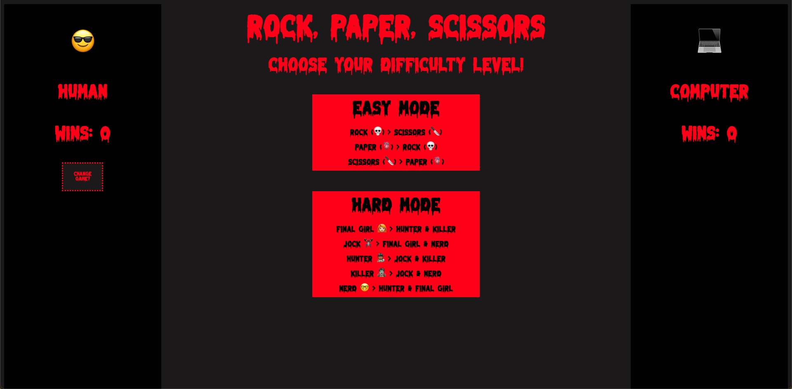

# Rock Paper Scissors
### Abstract:
Rock, Paper, Scissors is a front end application built from scratch in Javascript, HTML, and CSS that allows the user to play against a computer. There are two difficulty levels, one with the classic 3 moves and one with five moves. The theme of this application is classic slasher type horror movies. Please enjoy!

### Installation Instructions:
- Fork this project to your own Github account. 
- Clone the repository to your local machine using your computer's command line. 
- `cd` into the project. 
- Type: open index.html

### Preview of App:

### Context:
Rock, Paper, Scissors was the final project of the first Module at [Turing School of Software and Design](https://turing.edu/). This was my chance to showcase all that I'd learned in the past six weeks including: vanilla javascript foundations, object literals, classes, problem solving strategies, HTML and CSS basics, git version control, and professional technical workflow.

### Contributors:
- Chrissy Cooper - [LinkedIn](https://www.linkedin.com/in/christine-cooper-691196144/)
- The font was made by [DM Studio](https://www.behance.net/dmletter314814) and found on [dafont.com](https://www.dafont.com/melted-monster.font)

### Learning Goals:
The learning goals of this project include: 
- Writing clean, easy to read code that is DRY
- Utilizing event delegation to reduce the number of event listeners and handle multiple events
- Practice understanding the difference between the data model and how that data is displayed on the DOM
- Build an application from scratch solo!

### Wins + Challenges:

#### Wins:
- I am very happy with some of my refactoring, specifically the way I chose to set up the game board data within the game class, this setup really helped make my code more readable and simplified a lot of if/else statements.

#### Challenges:
- That being said, I also know there is a long way to go in terms of DRYing up my codebase and simplifying more conditional logic to reduce the number of lines.
- It was both great and tough to be the only one making decisions about how to structure the application. I learned a lot by following a few ideas through to failure or clunkiness to find a different solution I liked better.